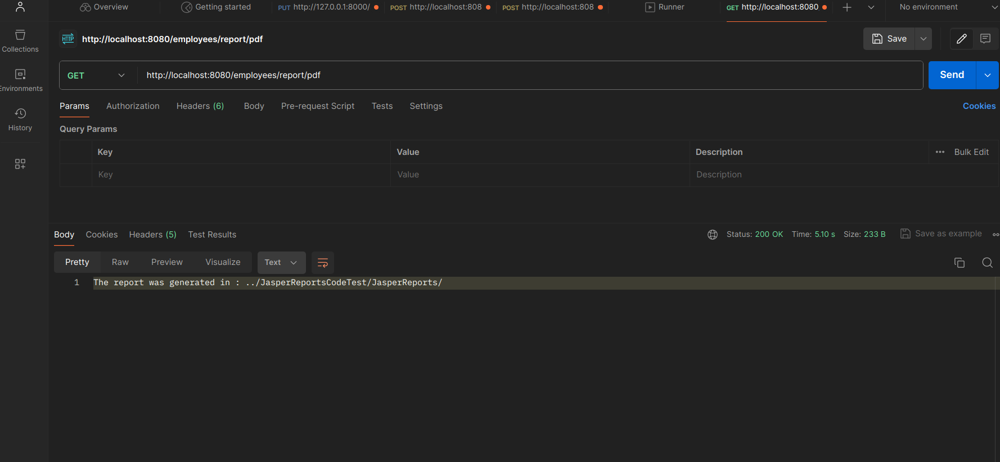
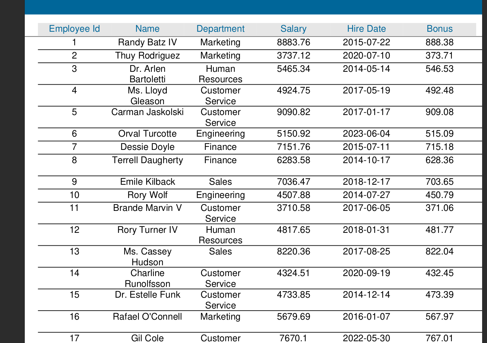
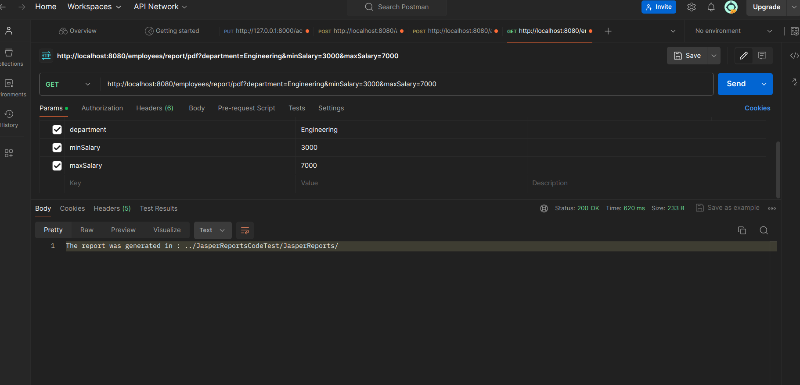
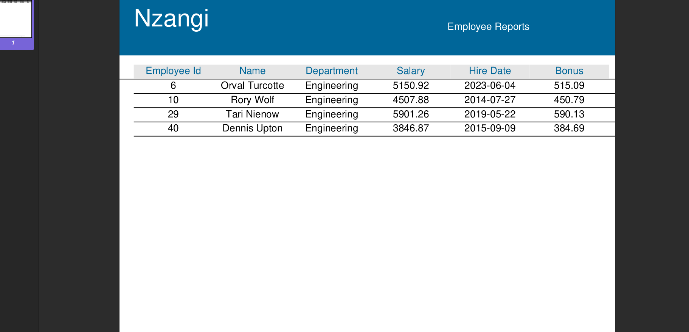
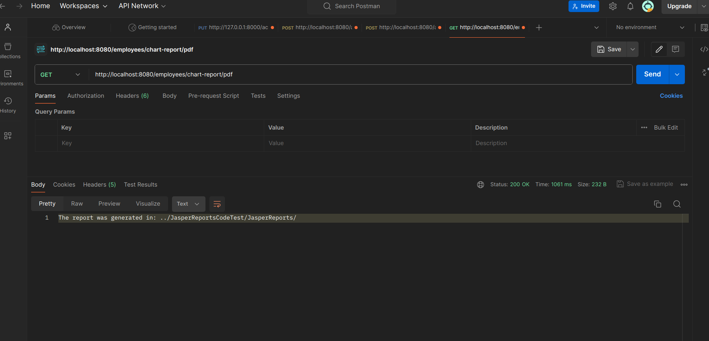
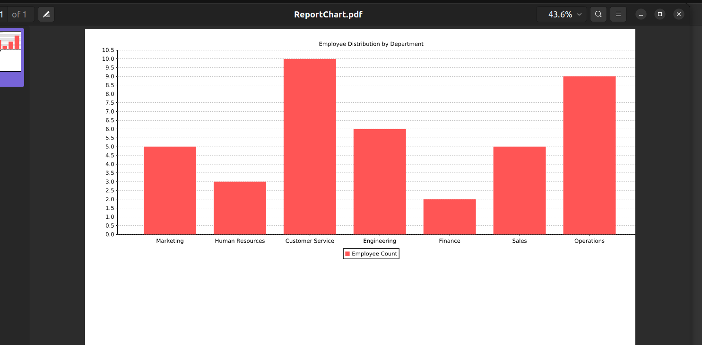
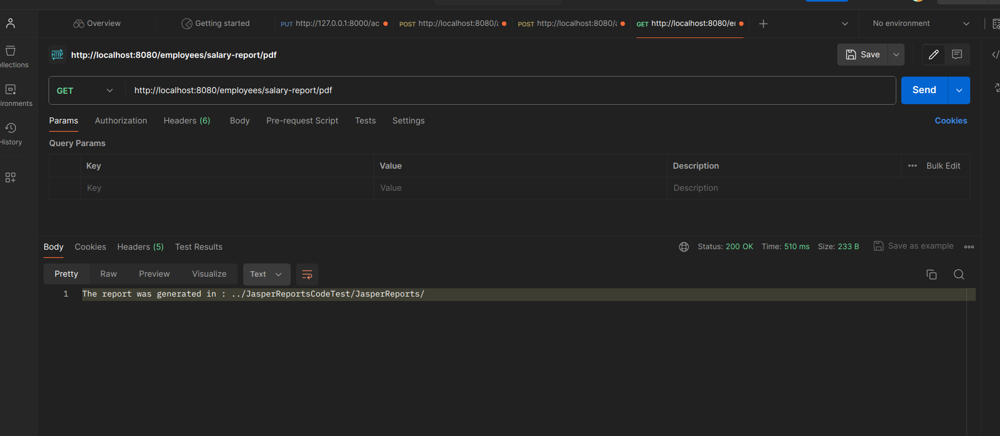
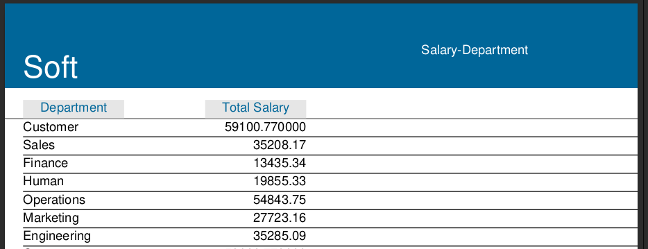
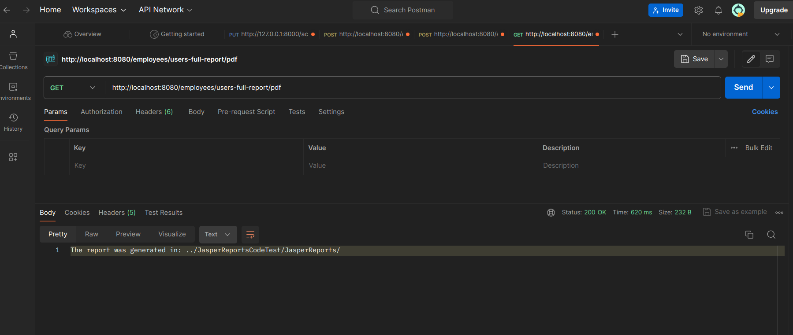
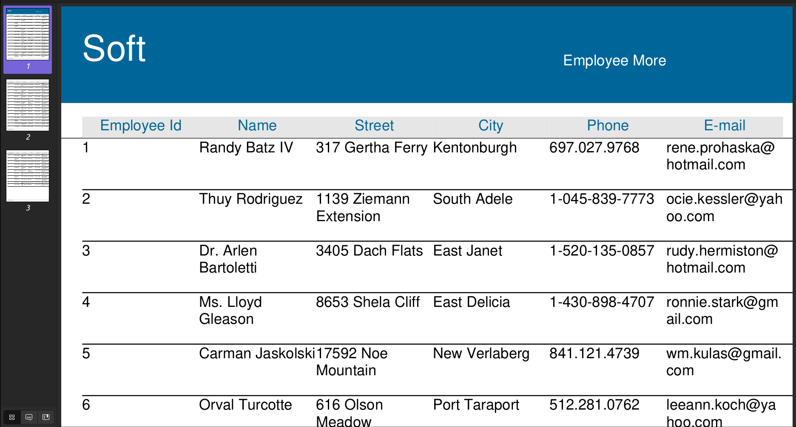

# JasperReportsCodeTest Project
## 📋 <a name="table">Table of Contents</a>

1. 🤖 [Introduction](#introduction)
2. ⚙️ [Tech Stack](#tech-stack)
3. 🔋 [Features](#features)
4. 🤸 [Quick Start](#quick-start)
5. 🔗 [Snippets](#snippets)
6. 🚀 [Output](#output)

## <a name="introduction">🤖 Introduction</a>
This is a Jasper Report Development using Spring Boot and Jasper. The project
focuses on report generation according to the data which is on the database.

Project aims to developer reports using Jasper library.

## <a name="#tech-stack">️️⚙️️ Tech Stack</a>
- Spring Boot
- Spring Data JPA
- Spring Web
- MySQL
- Jasper 
- Postman

## <a name="features">🔋 Features</a>
👉 **Generate Report** : All the Employees on the 
system on the project are populate on the PDF or HTML according 
to the format which you need.<br>
👉 **Filter Employee according to Department** : The employee are
filtered to show only the ones who range the chosen range. <br>
👉 **Contact and Address Information**: The generated report will be only Employee name,contact and address information<br/>
👉 **Calculate Bonus** : The employee bonus is calculated on 10 % of his salary.<br/>
👉 **Grouping and Aggregation** : Employees  salery is summed in each department and the total salary is shown each department.<br/>
👉 **Chart Generation** : The Employees are grouped in Department and Count in each department on Barchart. <br/>

## <a name="quick-start">🤸 Quick Start</a>
Follow the following Steps to install the project on your local machine<br/>
**Prerequisites**<br/>
Make sure you have the following installed on your machine:
- [Git](https://git-scm.com/)
- [Java 17](https://www.oracle.com/ke/java/technologies/downloads/)

**Database Connection**

To connect the project with your database you need change 
the [application.properties](https://github.com/nzangi/JasperReportsCodeTest/blob/main/src/main/resources/application.properties) file
```angular2html
spring.application.name=JasperReportsCodeTest
spring.datasource.url = jdbc:mysql://localhost:3306/< Your Database Name>

spring.datasource.username = < Your Database Name>
spring.datasource.password = < Your MySQL Password>

spring.jpa.properties.hibernate.dialect = org.hibernate.dialect.MySQLDialect
spring.jpa.show-sql = true

spring.jpa.hibernate.ddl-auto = update


```
**Cloning the Repository**
1. Clone the repository $ git clone https://github.com/nzangi/JasperReportsCodeTest.git
2. Import the project inside Intellij IDEA -Open Intellij IDEA > choose where project was clone to
3. Make sure you are in the banking-application directory.
4. Ensure you have Java 17 installed.
5. Run the application using Intellij IDEA. 

**Alternative way to run the project** <br/>
Open Terminal in Linux or MacOS or CMD on windows and run the command where you have downloaded the repository.
```angular2html
install mvn
```
Then
```angular2html
spring-boot:run
```

## <a name="snippets">🕸️ Snippets</a>
<details>
<summary><code>EmployeeController.java</code></summary>
 This is the function which is responsible for generating the data which is on the database. It is generating 10 rows per one.
You can comment the line to disable addition of the data in db,
comment on this line

```
        employeeRepository.saveAll(fakeEmployees);
```

    @PostConstruct
    public void initializeData() {
        Faker faker = new Faker();
        List<String> departments = Arrays.asList("Engineering", "Marketing", "Sales", "Finance", "Operations", "Human Resources", "Customer Service");
        SimpleDateFormat sdf = new SimpleDateFormat("MM/dd/yyyy");
        List<Employee> fakeEmployees = IntStream.range(0, 10)
                .mapToObj(i -> {
                    Employee employee = new Employee();
                    employee.setEmployeeName(faker.name().fullName());
                    String randomDepartment = departments.get(faker.random().nextInt(departments.size()));
                    employee.setEmployeeDepartment(randomDepartment);
                    employee.setEmployeeSalary(faker.number().randomDouble(2, 3000, 10000));

                    Address address = new Address();
                    address.setStreet(faker.address().streetAddress());
                    address.setCity(faker.address().city());
                    address.setZipcode(faker.address().zipCode());
                    employee.setAddress(address);

                    ContactInformation contactInformation = new ContactInformation();
                    contactInformation.setPhoneNumber(faker.phoneNumber().cellPhone());
                    contactInformation.setEmail(faker.internet().emailAddress());
                    employee.setContactInformation(contactInformation);

                    LocalDateTime hireDateTime = faker.date().past(3650, TimeUnit.DAYS).toInstant().atZone(ZoneId.systemDefault()).toLocalDateTime();
                    employee.setEmployeeHireDate(LocalDate.from(hireDateTime));
                    return employee;
                })
                .collect(Collectors.toList());

        employeeRepository.saveAll(fakeEmployees);
    }

</details>


## <a name="output">🚀 Output</a>
**Pure report Generation**<br/>
When an report argument is given to postman to generate report without filtering, the report comes with the bonus function being applied.<br/>

Output on the report <br/>

**Parameterised report Generation**<br/>
The report will be filtered to show on a certain department and with salary range.

The output report is as shown below

**Chart report Generation**<br/>
The chart generation report looks the following<br/>

The output for the chart showing the output


**Group Salary Report Generation**<br/>
Salary group generation url


The report output


**Contact Report Generation**<br/>
Salary group generation url


The output is 



